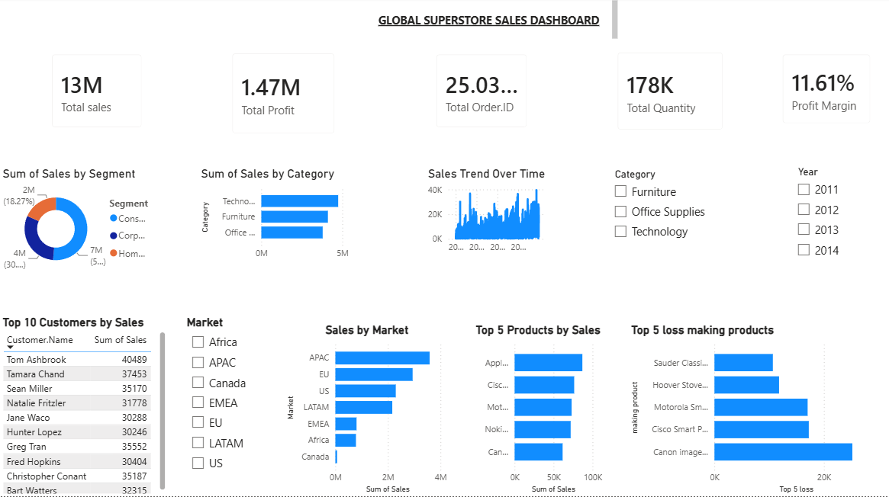

# 📊 Global Superstore Sales Dashboard

## 📌 Project Overview
This project presents an interactive Power BI dashboard built using the Global Superstore dataset. It provides valuable business insights by analyzing sales, profit, customer segments, and regional performance.

## 🛠️ Tools Used
- Power BI
- Power Query
- DAX

## 📈 Dashboard Features
- Total Sales
- Total Profit
- Sales by Category
- Sales by Region
- Monthly Sales Trend
- Top Products
- Interactive Filters & Slicers

## 💡 Skills Demonstrated
- Data Cleaning
- Data Transformation
- Data Modeling
- DAX Calculations
- Data Visualization

## 📷 Dashboard Preview

